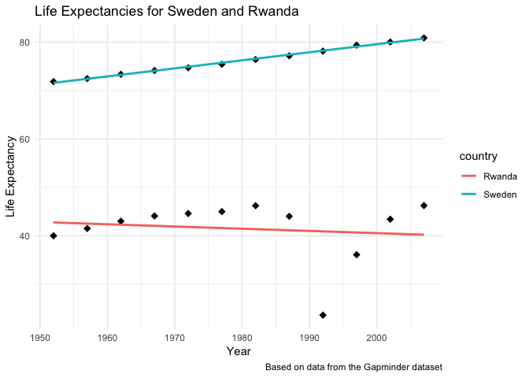

Homework 04: Tidy data and joins
================
Adam Mattsson
2018-10-09

Data Reshaping Prompts (and relationship to aggregation)
--------------------------------------------------------

**Problem:** You have data in one “shape” but you wish it were in another. Usually, this is because the alternative shape is superior for presenting a table, making a figure, or doing aggregation and statistical analysis.

**Solution:** Reshape your data. For simple reshaping, `gather()` and `spread()` from tidyr will suffice. Do the thing that is possible / easier now that your data has a new shape.

### Activity 2

Make a table with one row per year and columns for life expectancy for two or more countries:

-   Use `knitr::kable()` to make this table look pretty in your rendered homework.
-   Take advantage of this new data shape to **scatterplot** life expectancy for one country against that of another.

For this task, let's compare life expectancy for three countries. I will use the `filter()` to select the countries of interest and then I'll execute `select()` to retain appropriate columns. But first, let's load required packages and bring in rectangular data.

``` r
suppressWarnings(suppressMessages(library(gapminder))) 
suppressWarnings(suppressMessages(library(ggplot2)))
suppressWarnings(suppressMessages(library(tidyverse)))
suppressWarnings(suppressMessages(library(knitr)))
```

Now, let's create this new data frame with the countries of interest and select the right varaibles

``` r
filt_gapminder = gapminder %>% #create new varaible
  filter(country %in% c("Sweden", "Rwanda")) %>% #filter out Sweden and Rwanda from original gapminder dataset
  select(country, year, lifeExp) #select varaibles

knitr::kable(head(filt_gapminder, n=5)) #output result as table
```

| country |  year|  lifeExp|
|:--------|-----:|--------:|
| Rwanda  |  1952|     40.0|
| Rwanda  |  1957|     41.5|
| Rwanda  |  1962|     43.0|
| Rwanda  |  1967|     44.1|
| Rwanda  |  1972|     44.6|

Perfect, now we have a new data frame, only containing entries from Sweden and Rwanda. The selected variables are `gapminder$country`, `gapminder$lifeExp` and `gapminder$year`.

The next task of this assignment is to reshape the data. The goal is to obtain one year per row were the columns are life expectancy for the two selected countries. The `spread()` function is called in order to convert a single column into multiple columns.

``` r
refilt_gap = filt_gapminder %>% #create new data frame
        spread(country,lifeExp) #use spread function to convert a single column in to multiple

#present result in table
knitr::kable(refilt_gap, col.names = c('Year','Life Expectancy in Rwanda', 'Life Expectancy in Sweden'),
        align = 'c',
        format = 'markdown')
```

| Year | Life Expectancy in Rwanda | Life Expectancy in Sweden |
|:----:|:-------------------------:|:-------------------------:|
| 1952 |           40.000          |           71.860          |
| 1957 |           41.500          |           72.490          |
| 1962 |           43.000          |           73.370          |
| 1967 |           44.100          |           74.160          |
| 1972 |           44.600          |           74.720          |
| 1977 |           45.000          |           75.440          |
| 1982 |           46.218          |           76.420          |
| 1987 |           44.020          |           77.190          |
| 1992 |           23.599          |           78.160          |
| 1997 |           36.087          |           79.390          |
| 2002 |           43.413          |           80.040          |
| 2007 |           46.242          |           80.884          |

Success, the data has now been reshaped to one year per row were the columns are life expectancy for the two selected countries.

Let's plot the difference in lifeExp between Sweden and Rwanda in a scatterplot usining ggplot.

``` r
filt_gapminder %>% ggplot(aes(x = year, y = lifeExp, colour = country)) + 
    geom_point(colour = "black", size = 3, shape = 18) + #add geom_point for each country
    geom_smooth(method="lm", se = FALSE) + #add geom_smooth for both countries
  theme_minimal() + #specify theme
      labs(x = "Year", y = "Life Expectancy", title = "Life Expectancies for Sweden and Rwanda", caption = "Based on data from the Gapminder dataset") #adding lables
```



Awesome, the generated plot is perfect for comparing life expectancy for the two selected countries. We can see that life expectancy for Sweden is considerably higher compared to Rwanda. Notice the early 90's entry for Rwanda, this entry is most likely reflecting the genocide that took place in Rwanda in the early nineties.

Join Prompts (join, merge, look up)
-----------------------------------

**Problem:** You have two data sources and you need info from both in one new data object.

**Solution:** Perform a join, which borrows terminology from the database world, specifically SQL.

### Activity 1

Create a second data frame, complementary to Gapminder. Join this with (part of) Gapminder using a dplyr join function and make some observations about the process and result. Explore the different types of joins. Examples of a second data frame you could build:

-   One row per country, a country variable and one or more variables with extra info, such as language spoken, NATO membership, national animal, or capital city. If you really want to be helpful, you could attempt to make a pull request to resolve this issue, where I would like to bring ISO country codes into the gapminder package.

-   One row per continent, a continent variable and one or more variables with extra info, such as northern versus southern hemisphere.

For this task I chosed to create a second data frame (complementary to gapminder). The second data frame contains information of the spoken language in a specific country. This new dataframe will be merged with gapminder data exploring different join functions.

``` r
country <- c("Sweden", "Canada", "Spain", "Germany", "Brazil", "Mexico") #Specifying countries in new data fraame
language <- c("Swedish", "English", "Spanish", "German", "Portuguese", "Spanish") #adding coresponding spoken languages for each country
gap_comp <- data.frame(country, language) #creating new dataframe, complementary to gapminder

#presenting new dataframe as a table.
knitr::kable(gap_comp, col.names = c('Country','Spoken language'),
        align = 'c',
        format = 'markdown')
```

| Country | Spoken language |
|:-------:|:---------------:|
|  Sweden |     Swedish     |
|  Canada |     English     |
|  Spain  |     Spanish     |
| Germany |      German     |
|  Brazil |    Portuguese   |
|  Mexico |     Spanish     |

Now that we have this second complementary data frame, let's join it with the gapminder data. First, I need to investigate if all the countries from the `gapminder` data set are present in the second data frame. This task is tackled by calling the `semi_join()` function. The returned table shows what countries in `gapminder` that we have data for in the created second data frame.

``` r
semi_join <- semi_join(gapminder, gap_comp, by = c("country","country")) #Return all rows from x where there are matching values in y, keeping just columns from x.
```

    ## Warning: Column `country` joining factors with different levels, coercing
    ## to character vector

``` r
knitr::kable(head(semi_join)) #output as table
```

| country | continent |  year|  lifeExp|        pop|  gdpPercap|
|:--------|:----------|-----:|--------:|----------:|----------:|
| Brazil  | Americas  |  1952|   50.917|   56602560|   2108.944|
| Brazil  | Americas  |  1957|   53.285|   65551171|   2487.366|
| Brazil  | Americas  |  1962|   55.665|   76039390|   3336.586|
| Brazil  | Americas  |  1967|   57.632|   88049823|   3429.864|
| Brazil  | Americas  |  1972|   59.504|  100840058|   4985.711|
| Brazil  | Americas  |  1977|   61.489|  114313951|   6660.119|

As expected, the returned table contains merged information from the complementary data frame. Spoken language is added to every row in gapminder were there's information available. Next up is to investigate what countries from `gapminder` data that we don't have any information in regards to spoken language. This problem is addressed utilizing the `anti_join()` function.

``` r
anti_join <- anti_join(gapminder, gap_comp, by = c("country","country")) #Return all rows from x where there are not matching values in y, keeping just columns from x.
```

    ## Warning: Column `country` joining factors with different levels, coercing
    ## to character vector

``` r
knitr::kable(head(anti_join)) #output as table
```

| country     | continent |  year|  lifeExp|       pop|  gdpPercap|
|:------------|:----------|-----:|--------:|---------:|----------:|
| Afghanistan | Asia      |  1952|   28.801|   8425333|   779.4453|
| Afghanistan | Asia      |  1957|   30.332|   9240934|   820.8530|
| Afghanistan | Asia      |  1962|   31.997|  10267083|   853.1007|
| Afghanistan | Asia      |  1967|   34.020|  11537966|   836.1971|
| Afghanistan | Asia      |  1972|   36.088|  13079460|   739.9811|
| Afghanistan | Asia      |  1977|   38.438|  14880372|   786.1134|

This returns a list of all of the countries in gapminder dataframe where we don't have any information on spoken language (in the complementary data frame). Next up is to add information about the spoken language that corresponds to a specific country. This is achieved by calling the inner\_join()\` function, as such:

``` r
inner_join <- inner_join(gapminder, gap_comp, by = c("country","country")) #Return all rows from x where there are matching values in y, and all columns from x and y. 
```

    ## Warning: Column `country` joining factors with different levels, coercing
    ## to character vector

``` r
knitr::kable(head(inner_join)) #output as table
```

| country | continent |  year|  lifeExp|        pop|  gdpPercap| language   |
|:--------|:----------|-----:|--------:|----------:|----------:|:-----------|
| Brazil  | Americas  |  1952|   50.917|   56602560|   2108.944| Portuguese |
| Brazil  | Americas  |  1957|   53.285|   65551171|   2487.366| Portuguese |
| Brazil  | Americas  |  1962|   55.665|   76039390|   3336.586| Portuguese |
| Brazil  | Americas  |  1967|   57.632|   88049823|   3429.864| Portuguese |
| Brazil  | Americas  |  1972|   59.504|  100840058|   4985.711| Portuguese |
| Brazil  | Americas  |  1977|   61.489|  114313951|   6660.119| Portuguese |

It's also possible to use the `full_join()` function. By calling this functions it will return all rows and all columns from both x and y. Where there are not matching values, returns NA for the one missing (mutating join).

``` r
full_join <- full_join(gapminder, gap_comp, by = c("country","country")) #Return all rows and all columns from both x and y. Where there are not matching values, returns NA for the one missing. This is a mutating join.
```

    ## Warning: Column `country` joining factors with different levels, coercing
    ## to character vector

``` r
knitr::kable(head(full_join)) #output as table
```

| country     | continent |  year|  lifeExp|       pop|  gdpPercap| language |
|:------------|:----------|-----:|--------:|---------:|----------:|:---------|
| Afghanistan | Asia      |  1952|   28.801|   8425333|   779.4453| NA       |
| Afghanistan | Asia      |  1957|   30.332|   9240934|   820.8530| NA       |
| Afghanistan | Asia      |  1962|   31.997|  10267083|   853.1007| NA       |
| Afghanistan | Asia      |  1967|   34.020|  11537966|   836.1971| NA       |
| Afghanistan | Asia      |  1972|   36.088|  13079460|   739.9811| NA       |
| Afghanistan | Asia      |  1977|   38.438|  14880372|   786.1134| NA       |

As expected, we see NA's for countries that had no information in terms of spoken language in the gapminder complementary data frame.
